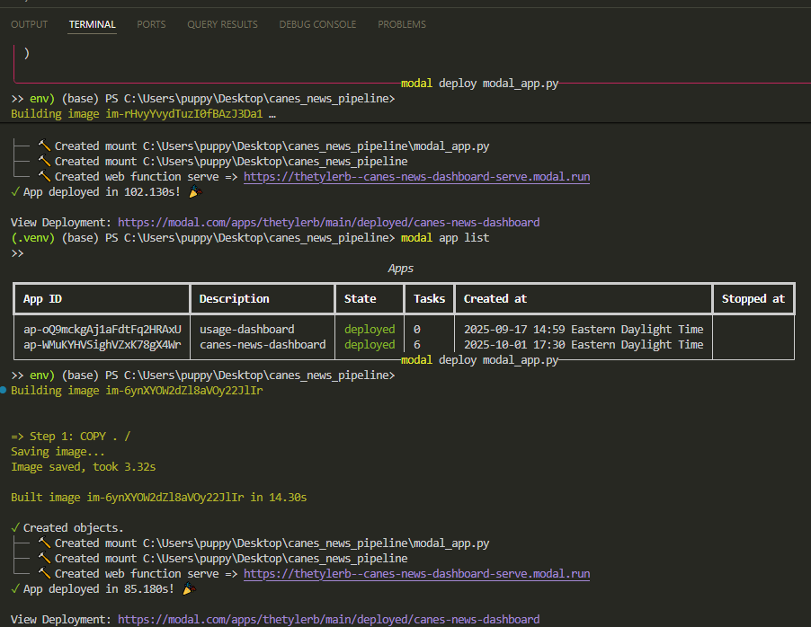
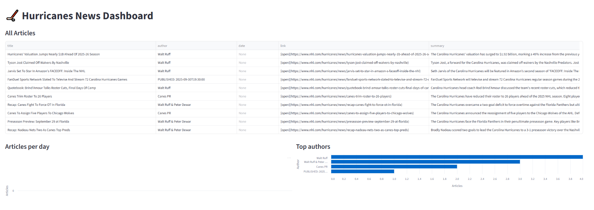
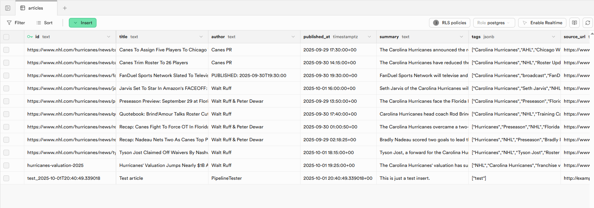

# 🏒 Hurricanes News Dashboard

A full pipeline project that collects Carolina Hurricanes news articles, structures the data with LLMs, stores it in Supabase, and visualizes insights in a Streamlit dashboard deployed on Modal.

---

## 🚀 Features
- **Web Scraping**: Collects fresh Carolina Hurricanes news articles.
- **Data Structuring**: Uses GPT to normalize scraped content into JSON (title, author, published date, summary, tags, link).
- **Database Storage**: Saves structured data into a Supabase `articles` table with RLS policies for secure access.
- **Visualization**: Streamlit dashboard showing:
  - All articles with metadata
  - Articles per day
  - Top authors by article count
- **Deployment**: Dashboard runs on [Modal](https://modal.com) with automatic builds.

---

## 🛠️ Tech Stack
- **Python** (3.11)
- **Supabase** (Postgres, row-level security)
- **OpenAI GPT-4o** (structuring unstructured text)
- **Streamlit** (interactive dashboard)
- **Modal** (serverless deployment)

## Proof of Deployment

### 1) Modal deployment output

### 2) Live dashboard (local run)

### 3) Supabase table populated

---

## 📂 Project Structure
canes_news_pipeline/
│── .venv/ # virtual environment
│── data/ # intermediate and structured data
│ ├── raw_blob.txt
│ ├── structured.json
│── src/ # pipeline scripts
│ ├── collect.py # scrape articles
│ ├── structure.py # LLM structuring
│ ├── load.py # load into Supabase
│── streamlit_app.py # dashboard
│── modal_app.py # deployment entrypoint
│── .env # Supabase keys (gitignored)
│── .gitignore
│── README.md